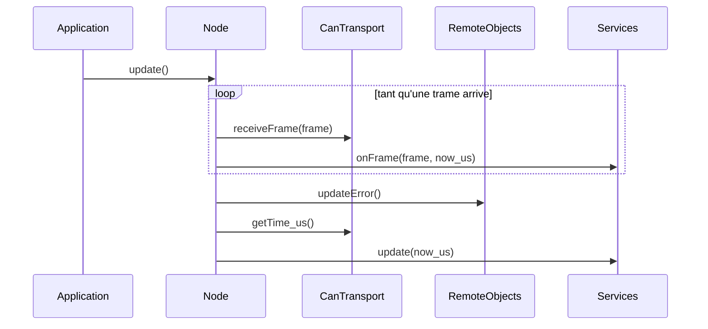

# Vue d'ensemble

## Le nœud

`Node` (voir `src/node.hpp`) possède le dictionnaire d'objets et la machine d'états NMT.
Il ne contient aucun protocole. Les services de protocole sont des objets séparés que
l'application attache.

```cpp
Node(CanTransport &transport, Persistence &persistence, RemoteObjects &remote);
bool attach(Service &service);
void init();
void update();
void receiveFrame(Frame frame);
uint32_t getTime_us();
ObjectDictionnary &od();
ODAccessor &odAccessor();
NMT &nmt();
```

L'application possède le transport, la persistance et les objets distants. Elle les
garde vivants pendant toute la vie du nœud.

## Le bus de services

`Node` hérite de `ServiceBus`. Chaque service implémente l'interface `Service` (voir
`src/service.hpp`) :

| Méthode | Rôle |
|---|---|
| `init()` | résout les objets du dictionnaire d'objets, appelée par `Node::init()` |
| `consumes(FunctionCodes)` | déclare les codes de fonction traités |
| `onFrame(Frame &, uint32_t now_us)` | traite une trame reçue |
| `update(uint32_t now_us)` | exécute le travail périodique |
| `onNmtState(NMTStates)` | réagit à un changement d'état NMT |

La macro `CANOPEN_MAX_SERVICES` fixe le nombre de services attachables. Sa valeur par
défaut est 8. `attach()` renvoie `false` quand la table est pleine.

## Le cycle d'exécution



`Node::init()` initialise le transport, la persistance et les objets distants, appelle
`init()` sur chaque service, puis démarre la machine d'états NMT. Attachez tous les
services avant `init()`.

`Node::receiveFrame()` route les trames NMT vers la machine d'états, et les autres vers
chaque service qui déclare consommer leur code de fonction. Appelez-la vous-même
uniquement pour des trames venues d'une autre source.

## FullNode

`FullNode` (voir `src/full-node.hpp`) assemble un nœud complet. Il construit les cinq
services, les attache et les lie au dictionnaire d'objets.

```cpp
FullNode canopen(transport, persistence, remote);
canopen.init();
while (true) canopen.update();
```

Les membres publics sont `node`, `hb`, `sdo`, `pdo`, `sync` et `emcy`.

## Pile minimale

Une application qui a besoin de moins construit les services qu'elle veut.

```cpp
#include "hb/hb.hpp"
#include "node.hpp"
#include "sdo/sdoServer.hpp"

static CANopen::Node node(transport, persistence, remote);
static CANopen::HB hb(node.od(), transport, node.nodeId);
static CANopen::SDO sdo(node.odAccessor(), transport, node.nodeId);

int main() {
    node.attach(hb);
    node.attach(sdo);
    CANopen::bindHeartbeat(hb);
    node.init();
    while (true) node.update();
}
```

Chaque service qui sert des objets du dictionnaire d'objets doit être lié. Les
fonctions de liaison sont déclarées dans `src/od_common.hpp` :

| Fonction | Objets servis |
|---|---|
| `bindHeartbeat(HB &)` | `0x1017` |
| `bindSync(SYNC &)` | `0x1019` |
| `bindEmergency(EMCY &)` | `0x1001`, `0x1003`, `0x1029` |
| `bindPdo(PDO &)` | `0x1400`–`0x1BFF` |

Un objet dont le service n'est pas lié répond `SDOAbortCode_ObjectNonExistent`.

`make lib-minimal` et `make test-minimal` compilent cette configuration contre le
dictionnaire d'objets de `tests/golden/bootloader/cm`, sans lier PDO, SYNC ni EMCY.

## Un seul nœud par programme

!!! warning "Contrainte"

    Un programme ne contient qu'un seul nœud. Les tables du dictionnaire d'objets sont
    des données statiques et le numéro du nœud vient de `od.hpp`.

`Node::Node()` appelle `bindHardware()`, qui route le dictionnaire d'objets vers le
transport, la persistance et les objets distants. Cette liaison est unique.

## Concurrence

La pile ne protège rien. `update()` interroge le transport, donc une boucle unique est
la solution la plus simple.

Si les trames arrivent depuis une interruption ou un fil d'exécution, deux options :

- mettre les trames en file, puis les rendre depuis `receiveFrame()` de la boucle ;
- protéger `update()` par un mutex.

## Paramètres sauvegardés

Chargez les paramètres avant `init()`. Sauvegardez-les depuis l'application ou par
l'objet `0x1010`.

```cpp
node.od().loadData(ParameterGroup_All);
node.init();
node.od().saveData(ParameterGroup_Application);
```

La machine d'états NMT recharge déjà les paramètres à chaque reset. Voir
[NMT](../services/nmt.md).
