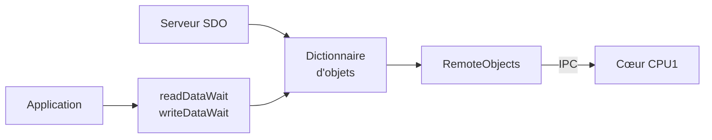

# Objets distants

Un objet distant vit sur le cœur CPU1. Le cœur CM ne garde aucune copie de sa valeur.

## Déclaration

Le champ `remote` nomme le cœur qui sert l'objet. Sa valeur par défaut est `local`.

```yaml
  0x6064:
    remote: cpu1
    get: remote.position
  0x2005:
    name: A remote value
    module: fixture
    remote: cpu1
    get: remote.getValue()
    set: remote.setValue(@)
    datatype: uint32
    access: rw
    default: 0
```

`get` et `set` sont des expressions C++ évaluées sur le cœur CPU1. Le caractère `@`
désigne la valeur écrite.

## Code produit

Le générateur rend les accesseurs dans `cpu1/od_remote.hpp`.

```cpp
inline void getobject2005sub0(Data &data) {
    data.u32 = remote.getValue();
}
inline void setobject2005sub0(const Data &data) {
    remote.setValue(data.u32);
}
```

Le fichier contient aussi :

| Symbole | Contenu |
|---|---|
| `remoteGetter[]`, `remoteSetter[]` | un accesseur par identifiant d'objet |
| `remoteGetterBSTKeys[]` | clés `(index << 8) \| subindex` des objets distants, triées |
| `remoteGetterBSTMap[]` | lecteur de chaque clé |
| `remoteTypeBSTMap[]` | type de chaque clé |

L'application du cœur CPU1 fournit le symbole `remote`. Le code produit s'y réfère sans
le définir.

## Forme de `set`

Le générateur choisit la forme du code produit :

| Écriture dans le YAML | Code produit |
|---|---|
| `set: remote.setValue(@)` | `remote.setValue(data.u32);` |
| `set: remote.doSomething()` | `remote.doSomething();` |
| `set: remote.attribute` | `remote.attribute = data.f32;` |

Une affectation vers un objet énuméré reçoit une conversion explicite vers le `typedef`
de l'énumération.

## Échelle

Le champ `scale` est le facteur entre la valeur CANopen et la valeur interne.

```yaml
  0x2006:
    name: A remote attribute
    module: fixture
    remote: cpu1
    scale: 0.001
    get: remote.attribute
    set: remote.attribute
    datatype: float32
    access: rw
    default: 0
```

Le générateur écrit :

```cpp
inline void getobject2006sub0(Data &data) {
    data.f32 = remote.attribute * 1000;
}
inline void setobject2006sub0(const Data &data) {
    remote.attribute = data.f32 * 0.001f;
}
```

La lecture multiplie par l'inverse de `scale`. L'écriture multiplie par `scale`. Un
`scale` de `1` ne produit aucune multiplication.

## Accès depuis le cœur CM

Le dictionnaire d'objets route un objet distant vers `RemoteObjects::getRemoteData()` et
`setRemoteData()`. Ces méthodes rendent `1` tant que le cœur CPU1 n'a pas répondu.



| Appelant | Méthode | Attente |
|---|---|---|
| serveur SDO | `ODAccessor::poll()` | `CANOPEN_SDO_REMOTE_TIMEOUT_US`, 100 ms |
| service PDO | `getRemoteTPDO()`, `setRemoteRPDO()` | aucune, accès direct |
| application | `readDataWait()`, `writeDataWait()` | 10 ms |

!!! warning "Ne bouclez pas vous-même"

    N'appelez pas `readData()` en boucle sur un objet distant. Utilisez
    `readDataWait()`, qui borne l'attente sur l'horloge du transport.

## Gestionnaire local

Un objet local peut lui aussi nommer ses fonctions d'accès avec `get` et `set`. Le
générateur y renvoie directement.

```yaml
  0x1017:
    get: hbGetData
    set: hbSetData
```

La fonction déclarée respecte la signature commune :

```cpp
int8_t hbGetData(Data &data, int32_t id, SDOAbortCodes &abortCode);
int8_t hbSetData(const Data &data, int32_t id, SDOAbortCodes &abortCode);
```

C'est ainsi que les services servent leurs objets. Les fonctions sont déclarées dans
`src/od_common.hpp`. Voir [vue d'ensemble](../architecture/vue-ensemble.md).
