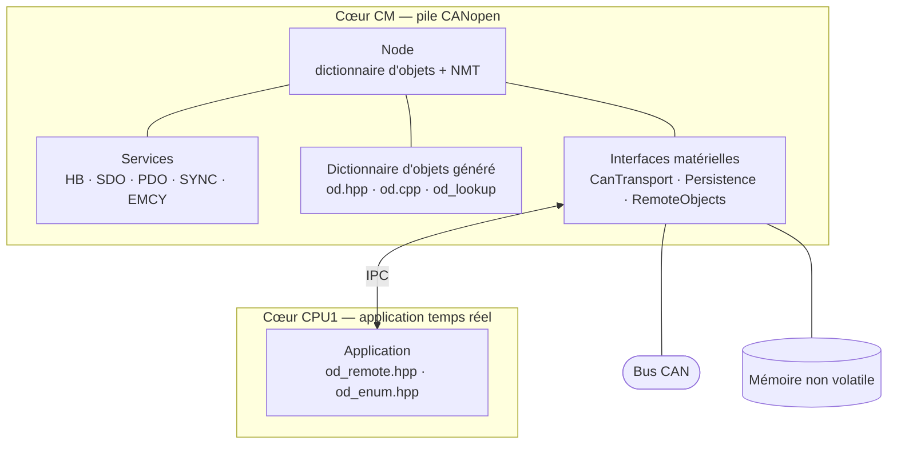

# CANopen Stack

Pile esclave CANopen écrite en C++14. Elle suit le profil de communication CiA 301.

La cible principale est un TMS320F28388D. Le cœur CM porte la pile. Le cœur CPU1 porte
l'application temps réel. La pile se compile aussi sur PC, au-dessus de SocketCAN.

## Fonctionnalités

- Dictionnaire d'objets généré en tables C++ statiques depuis une description YAML.
- Fichier EDS et documentation Markdown produits par le même générateur.
- Sauvegarde non volatile du dictionnaire d'objets, un groupe de paramètres à la fois.
- Esclave NMT piloté par le maître ou par l'application.
- Serveur SDO expédié, segmenté et par blocs, avec CRC.
- Objets DOMAIN diffusés en flux, sans copie complète en mémoire vive.
- PDO en émission et en réception, avec mapping dynamique, RTR, temps d'inhibition et
  temporisateur d'événement.
- Producteur heartbeat et node guarding.
- Consommateur SYNC avec compteur.
- Producteur EMCY avec registre d'erreurs et historique.
- Services attachés un par un : un bootloader ne lie que NMT, SDO et heartbeat.

## Architecture

## Par où commencer

- [Installation](demarrage/installation.md) : prérequis et outils.
- [Premier nœud](demarrage/premier-noeud.md) : générer, compiler, lancer.
- [Vue d'ensemble](architecture/vue-ensemble.md) : nœud, services, cycle `update()`.
- [Dictionnaire d'objets](architecture/dictionnaire.md) : tables, métadonnées, accès.
- [Générateur](generateur/utilisation.md) : ligne de commande et cibles.
- [Limitations](developpement/limitations.md) : ce que la pile ne fait pas.

!!! note "Historique du refactor"

    Le [rapport du refactor](rapport-refactor.md) décrit les changements de la branche
    `ace_refactor`. La [migration de sw-motion](migration-sw-motion.md) décrit le portage
    d'un firmware existant.
