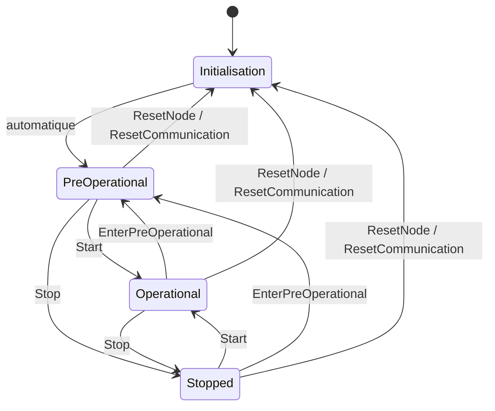

# NMT

`NMT` (voir `src/nmt/nmt.hpp`) est la machine d'états du nœud. Elle n'est pas un service
attachable : le nœud la possède et la construit lui-même.

Référence : CiA 301:2011 §7.3.2.

## Machine d'états



Les commandes que CiA 301 n'autorise pas depuis l'état courant sont ignorées.

## États et commandes

| État | Valeur |
|---|---|
| `NMTState_Initialisation` | `0x00` |
| `NMTState_Stopped` | `0x04` |
| `NMTState_Operational` | `0x05` |
| `NMTState_PreOperational` | `0x7F` |

| Commande | Valeur |
|---|---|
| `NMTServiceCommand_Start` | `0x01` |
| `NMTServiceCommand_Stop` | `0x02` |
| `NMTServiceCommand_EnterPreOperational` | `0x80` |
| `NMTServiceCommand_ResetNode` | `0x81` |
| `NMTServiceCommand_ResetCommunication` | `0x82` |

## Reset

Un reset suit toujours la même séquence :

1. Entrer dans `Initialisation`.
2. Charger l'image non volatile du groupe de paramètres.
3. Restaurer les valeurs par défaut si le chargement échoue.
4. Sur un reset node : réinitialiser le cœur CPU1, puis appeler le crochet `onReset`.
5. Entrer dans `PreOperational`.

Le groupe dépend de la commande :

| Commande | Groupe rechargé | Cœur CPU1 réinitialisé |
|---|---|---|
| `ResetNode` | `ParameterGroup_All` | oui |
| `ResetCommunication` | `ParameterGroup_Communication` | non |

`Node::init()` appelle `initSM()`, qui exécute la même séquence avec
`ParameterGroup_All`.

## API applicative

```cpp
if (node.nmt().getState() == NMTState_PreOperational)
    node.nmt().setTransition(NMTServiceCommand_Start);
```

Le crochet `onReset` s'exécute après un reset node, une fois le cœur CPU1 réinitialisé.

```cpp
node.nmt().onReset = [] { printf("reset\n"); };
```

!!! note "Pointeur de fonction"

    `onReset` est un `void (*)()`. Il n'accepte qu'une fonction libre ou une lambda
    sans capture.

## Effet sur les services

Chaque changement d'état est publié à tous les services attachés par
`Service::onNmtState()`.

| Service | `PreOperational` | `Operational` | `Stopped` |
|---|---|---|---|
| SDO | actif | actif | inactif |
| PDO | inactif | actif | inactif |
| SYNC | actif | actif | inactif |
| EMCY | actif | actif | inactif |
| HB | actif | actif | actif |

Le heartbeat émet le message de boot-up à la première transition d'`Initialisation`
vers `PreOperational`. Voir [heartbeat](heartbeat.md).

## Trames

Le nœud route toute trame de code de fonction `FunctionCode_NMT` vers la machine
d'états, avant les services. Une commande adressée au nœud ou diffusée est traitée ;
les autres sont ignorées.
