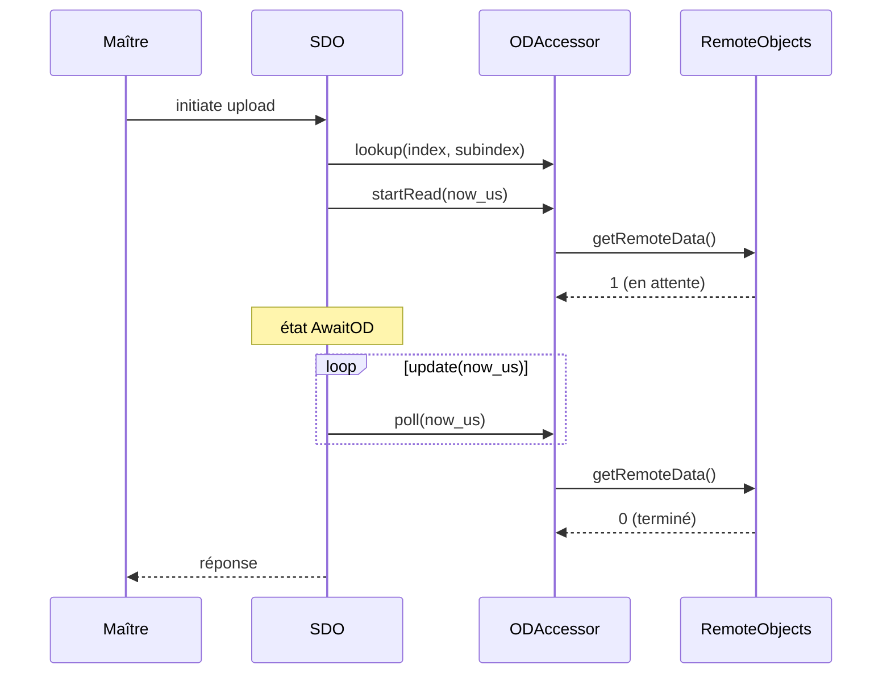

# SDO

`SDO` (voir `src/sdo/sdoServer.hpp`) est le serveur SDO du nœud. Il sert un seul canal,
celui du jeu de connexions prédéfini.

Référence : CiA 301:2011 §7.2.4.

## Transferts pris en charge

| Transfert | Sens | Note |
|---|---|---|
| Expédié | lecture et écriture | jusqu'à 4 octets |
| Segmenté | lecture et écriture | 7 octets par segment |
| Par blocs | lecture et écriture | jusqu'à 127 segments par bloc, CRC 16 bits |

Il n'y a pas de client SDO.

## Construction

```cpp
static CANopen::SDO sdo(node.odAccessor(), transport, node.nodeId);
node.attach(sdo);
```

Le serveur SDO ne sert aucun objet du dictionnaire d'objets, donc il n'a pas de
fonction de liaison. Il prend l'`ODAccessor` du nœud, pas le dictionnaire d'objets.

## États NMT

Le serveur est actif en `PreOperational` et en `Operational`. Toute autre transition
l'arrête et annule le transfert en cours.

## Accès au dictionnaire d'objets

`ODAccessor` (voir `src/od/odAccessor.hpp`) résout un objet à la fois et cache le
protocole asynchrone des objets distants.



`startRead()`, `startWrite()` et `poll()` rendent un `ODAccessor::Status` :
`Idle`, `Pending`, `Done` ou `Failed`.

## Objets DOMAIN

Un objet `DOMAIN` n'est jamais stocké en mémoire vive. Le serveur passe ses données au
`DomainHandler` enregistré sur l'accesseur.

```cpp
class DomainHandler {
   public:
    virtual SDOAbortCodes beginDownload(int32_t id, uint32_t size) = 0;
    virtual SDOAbortCodes downloadChunk(int32_t id, uint32_t offset,
                                        const uint8_t *bytes, uint32_t length) = 0;
    virtual SDOAbortCodes endDownload(int32_t id, uint32_t size) = 0;
    virtual void abortDownload(int32_t id) = 0;
    virtual uint32_t uploadSize(int32_t id) = 0;
    virtual SDOAbortCodes uploadChunk(int32_t id, uint32_t offset,
                                      uint8_t *bytes, uint32_t length) = 0;
};
```

Enregistrez le gestionnaire avant `init()` :

```cpp
canopen.node.odAccessor().setDomainHandler(&domain);
```

`beginDownload()` reçoit la taille annoncée par le maître, ou `0` quand elle est
inconnue. `example/linux/main.cpp` garde l'objet `0x2002` dans un tampon. Un bootloader
écrit les morceaux en mémoire flash.

## Configuration

Les macros de `src/sdo/config.hpp` se règlent à la compilation.

| Macro | Défaut | Rôle |
|---|---|---|
| `CANOPEN_SDO_TIMEOUT_US` | `1000000` | délai d'un transfert |
| `CANOPEN_SDO_BLOCK_TIMEOUT_US` | `100000` | délai entre deux sous-blocs |
| `CANOPEN_SDO_REMOTE_TIMEOUT_US` | `100000` | délai d'un accès à un objet distant |
| `CANOPEN_SDO_BLOCK_SIZE` | `127` | segments par bloc, entre 1 et 127 |

Définissez-les dans les options du compilateur, par exemple
`-DCANOPEN_SDO_TIMEOUT_US=2000000`.

Le tampon de bloc occupe `CANOPEN_SDO_BLOCK_SIZE * 7` octets. Réduisez la taille des
blocs sur une cible à mémoire vive limitée.

!!! warning "Seuil de bascule"

    Le serveur accepte le PST (protocol switch threshold) du maître, puis l'ignore. Il
    répond toujours à une demande de bloc par un transfert par blocs.
